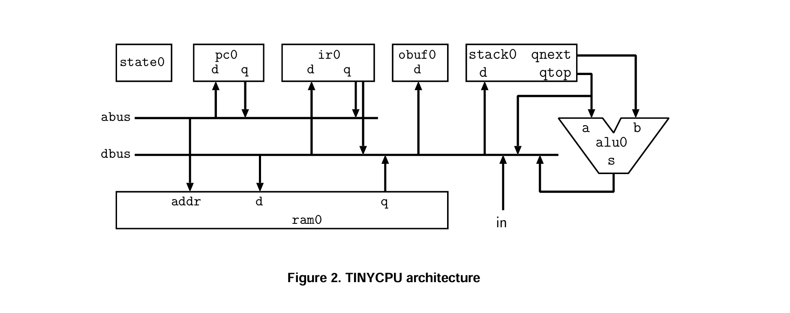
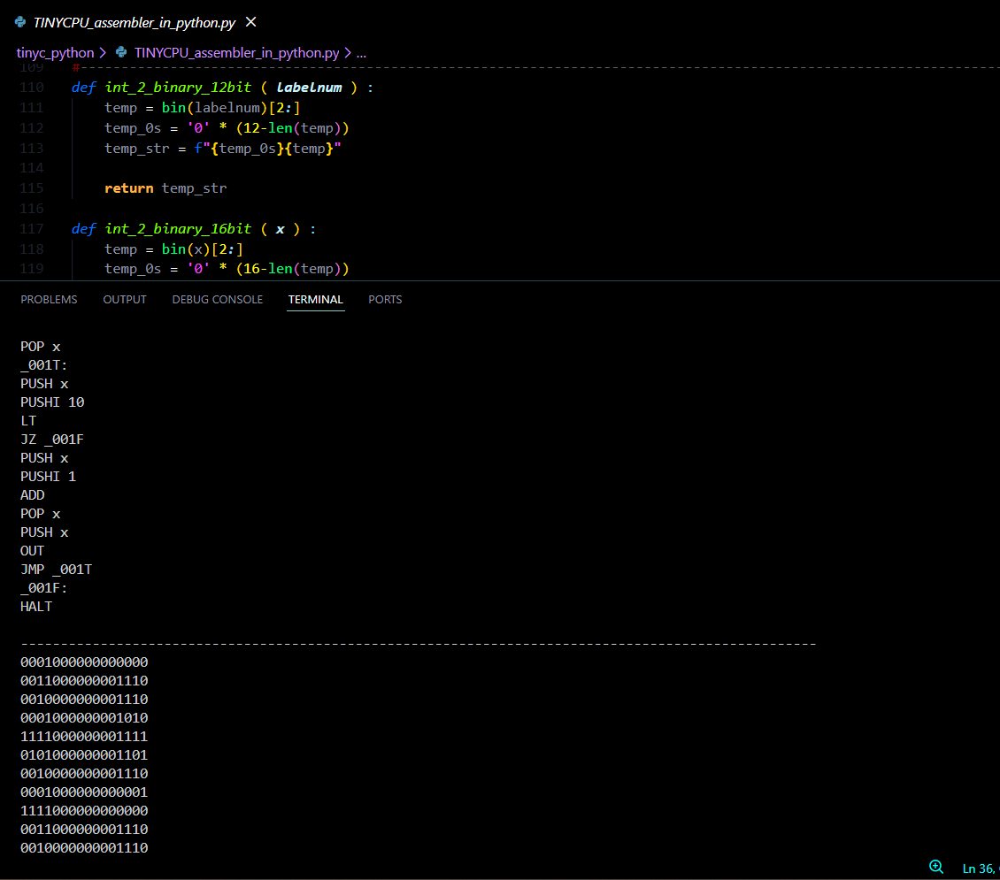

## Repository Structure
The repository is divided into 2 main parts, Hardware and Software , which they both have 2 different versions.  The following tree shows the file structure of the repository and then the parts will be explained separately.
```
Stack_Machine/
├── source_code/            
│   ├──tinyCPU/            # hardware  
│   |    ├──tinycpu.v
│   |    ├──alu.v 
│   |    ├──stack.v
|   |    ├──ram.v
|   |    ├──counter.v
|   |    ├──defs.v
|   |    └──state.v
│   |    
│   └──tinyasm_tinyc/       # Original Perl/Lex/Yacc toolchain
│        ├── tinyc.l
│        ├── tinyc.y
│        └── asm.pl
|        
├──tinyc_python/           # Python-based toolchain
│   ├── TINYCPU_compiler_in_python.py
│   ├── TINYCPU_assembler_in_python.py
│   ├── TINYCPU_mac2mem_in_python.py
│   ├── TINYCPU_toolchain_controler.py
│   ├── TINYCPU_code.c
|   ├── generated_assebly.txt
|   ├── generated_0and1s.txt
|   └── generated_mac2mem.txt
|
├──Modified_Version/       # Modified version folder 
|   ├──Modified_Stack_Machine/
│   |    ├──tinycpu.v
│   |    ├──alu.v 
│   |    ├──stack.v
|   |    ├──ram.v
|   |    ├──counter.v
|   |    ├──defs.v
|   |    ├──state.v
|   |    |
|   |    ├──Modified_Stack_Machine_AllInOne.v
|   |    └──testbench.v
|   |
|   └──Modified_tinyc_python/   
|        ├── TINYCPU_compiler_in_python.py
│        ├── TINYCPU_assembler_in_python.py
│        ├── TINYCPU_mac2mem_in_python.py
│        ├── TINYCPU_toolchain_controler.py
│        ├── TINYCPU_code.c
|        ├── generated_assebly.txt
|        ├── generated_0and1s.txt
|        └── generated_mac2mem.txt
|
├── pdf_s/                 # docs relatd to the cpu and software
│   ├── ...
│   └── ...
│
└── README.md
```

Both parts have 2 different versions , for hardare one version is the untouched version of the cpu that is explained just below and the other is the modified version that i wrote and will be explained later. The Software part has two plus versions , one is the compiler/assembler that the source provides , and two other version that i wrote and again will be explained in the next paragraphs.  

---
## Hardware Part:
### TINYCPU: A Stack Machine - A 16-bit Stack-Based Processor

The architecture and design of the CPU is from the University of Hiroshima and engineers there.  
Source code address: [source](https://www.cs.hiroshima-u.ac.jp/~nakano/wiki/#p5)

The CPU is FPGA-friendly and can be implemented efficiently on FPGA boards.

### Architecture:
In one word: Every operation is a stack operation!



- **Data Width:** 16-bit
- **Architecture:** Stack-based (8-level stack)
- **Memory:** 256 words RAM (configurable up to 4096)
- **ALU Operations:** 19 operations including arithmetic, logical, bitwise, and comparison
- **Instruction Set:** 12 instruction types
- **State Machine:** 5-state fetch-decode-execute cycle

**Instruction Set:**
```python
"HALT": "0000000000000000",

"PUSHI": "0001",  # 0001 (immidiate)
"PUSH" : "0010",  # 0010 ( address )
"POP"  : "0011",  # 0011 ( address )

"JMP"  : "0100",  # 0100 ( address )
"JZ"   : "0101",  # 0101 ( address )
"JNZ"  : "0110",  # 0110 ( address )

"IN"   : "1101000000000000",
"OUT"  : "1110000000000000",

"ADD"  : "1111000000000000",
"SUB"  : "1111000000000001",
"MUL"  : "1111000000000010",
"SHL"  : "1111000000000011",
"SHR"  : "1111000000000100",
"BAND" : "1111000000000101",
"BOR"  : "1111000000000110",
"BXOR" : "1111000000000111",
"AND"  : "1111000000001000",
"OR"   : "1111000000001001",
"EQ"   : "1111000000001010",
"NE"   : "1111000000001011",
"GE"   : "1111000000001100",
"LE"   : "1111000000001101",
"GT"   : "1111000000001110",
"LT"   : "1111000000001111",
"NEG"  : "1111000000010000",
"BNOT" : "1111000000010001",
"NOT"  : "1111000000010010",
```
---

## Software Part:
### Compiler-Assembler:

The source code provides a toolchain that can compile and assemble from a C-like language to the Verilog memory format, but I found it a bit hard to use and confusing, so I wrote a toolchain myself in Python that is really user-friendly!

**The Python compiler-assembler I wrote:**
- **TINYCPU_compiler_in_python.py:** Gets the C-like code address and generates the stack assembly
- **TINYCPU_assembler_in_python.py:** Gets the stack assembly and generates the binary
- **TINYCPU_mac2mem_in_python.py:** Gets the binary code and converts it to Verilog memory initialization format
- **TINYCPU_toolchain_controler.py:** Connects all 3 codes above for ease of use; only needs the path of the C-like code and does everything needed



**The C-like language:**

The C-like language that the compiler accepts has the following rules:
- Variable definition: only one per line
- Array support : supports only consistant indexing because of hardware limitations! and doesn't handle initialization by value  
- Math operations: only one per line and must be in the format `{operand0 operation operand1}`
- If-else and while: supported but must be written in one line
- Characters of different purposes are better separated by spaces
- Always remember to put `halt;` in the end of your codes , if you dont the variables will be over-written not interesting things will happen

**A valid example:**
```c
int x = 36 ;
int y ;
int i ;
int Some_Array[10] ;

while ( i <= 10 ) { if ( x == 36 ) { out( 1 ) ; i = i + 1 ; } else { out( 0 ) ; } }

if ( x == 36 ) { out( 1 ) ; i = i + 1 ; } else { out( 0 ) ; }

Some_Array[9] = Some_Array[0] + x ;

halt;
```
## Modified Version:
this version is what i did with the basic Stack_Machine. I changed some of the ISA inorder to able to use indirect addressing. this option is the basic need for CPUs to have the ability to support full array operations. The base CPU can't handle indirect addressing because the 5 stage 5-state fetch-decode-execute cycle is not enough for both handling the dynamic address and reading words from the memory ,basicaly FPGAs need at least 2 cycle for reading and writing to the RAMs that they have and for the indirect part we need one more cycle to first generate the indirect address and then do the memory operation , so i added one more state to the execution cycle , which is called `EXEXCC` and is only used in case of `PUSH_IND` and `POP_IND`. For supporting this change some modules needed some changes and for ease of use i put all the codes in the folder.
**Modified Instruction Set**
The Instruction Set that mentioned before pluss these two.
```python
"PUSH_IND" : "0111",  # 0111( array base address )
"POP_IND"  : "1000" , # 1000( array base address )
```
I also modified the base python toolchain that i had written earlier to support the arrays and indirect addressing. but there are some things about what it does and what does not support that i will point later.
**Modified Stack_Machine's Execution Cycle State Machine**
<!-- ‍‍‍‍‍‍‍‍‍‍‍‍‍‍‍ -->
```
                            ┌──────────┐
                     ┌─────►│   IDLE   │ (000)
                     │      │ (reset)  │
                     │      └────┬─────┘
                     │           │
                     │      run=1│
                     │           │
                     │           ▼
                     │      ┌──────────┐
                     │      │          │ (001)
                     │<─────│  FETCHA  │                                   
                     │      │          │<────────────────────────────┐          
                     │      └────┬─────┘                             |                
                     │           │                                   |                
                     │    always │                                   |      
                     │           │                                   |      
                     │           ▼                                   |                     
                     │      ┌──────────┐                             |                          
                     │      │          │ (010)                       |                     
                     │<─────│  FETCHB  │                             |                
                     │      │          │                             |                          
                     │      └────┬─────┘                             |                     
                     │           │                                   |                          
                     │    always │                                   |           
                     │           │                                   |                
                     │           ▼                                   |                
                     │      ┌──────────┐                             |     
               halt=1│      │  EXECA   │ (011)                       |                     
                     │      │          │             cont=0          |           
                     │      │ Decode   │────────────────────────────>|      
                     |<─────┤ Execute  │                             |                          
                     |      └────┬─────┘                             |           
                     |           │                                   |                          
                     |    cont=0 │                                   |
                     |           └────────────┐                      |
                     |                        │ cont=1               |
                     |                        │                      |
                     |                        │                      |
                     |                        ▼                      |
                     |                   ┌──────────┐                |
                     |                   │  EXECB   │ (100)          |
                     |                   │          │       cont=0   |
                     |                   │ PUSH: RAM│───────────────>|
                     |             cont=0│ *_IND:   │                |      
                     |                   │  ind2abus│                |      
                     |                   └────┬─────┘                |      
                     |                        │                      |      
                     |                        │ cont=1               |      
                     |                        │ (PUSH_IND only)      |      
                     |                        │                      |      
                     |                        ▼                      |      
                     |                   ┌──────────┐                |      
                     |                   │  EXECC   │ (101)          |      
                     |                   │          │                |      
                     └─────────<─────────│ PUSH_IND:│                |      
                                         │ ram2dbus │                |      
                                         │ push     │                |      
                                         └────┬─────┘                |      
                                              │                      |      
                                              │ always               |      
                                              │                      |      
                                              └───────────>──────────┘             
```

**Additional Points on C-like Language**
- In every line and statement the compiler supports only one array usage. 
- out cannot handle arrays. if want to out array value swap value with a variable.
```c
int x = 64 ;
int Some_Array[36] ;
int i ;

x = Some_Array[1] ;
Some_Array[2] = x ;

while ( i < 36 ) { x = A[i] ; out( x ) ; i = i + 1 ; }

halt;
```
- Don't forget to put `halt;` at the end
- And always code regarding this note and the note above about the compiler!
---
## Usage Flow:
no matter what version you use , 
1. Write the code in C-like language inside the file `TINYCPU_code.c` 
2. Use the Python toolchain to get memory initialization lines for the CPU
3. Add the memory initialization lines to the `ram.v` module
4. Implement the CPU on an FPGA
5. Let the CPU run your code!
---
                                                                                                                 
by [Alimt36](https://github.com/Alimt36) 